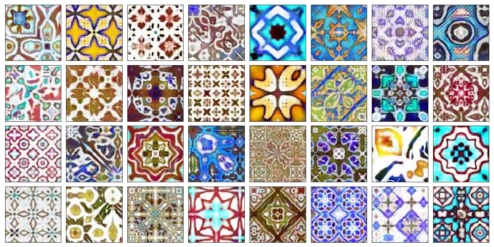
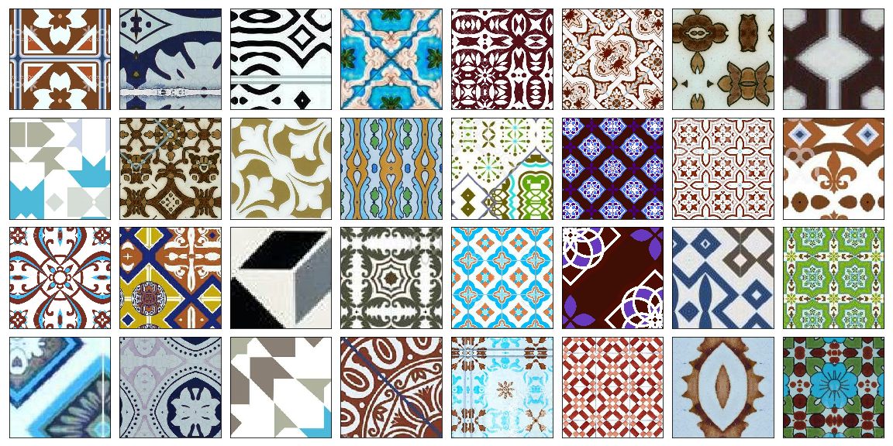
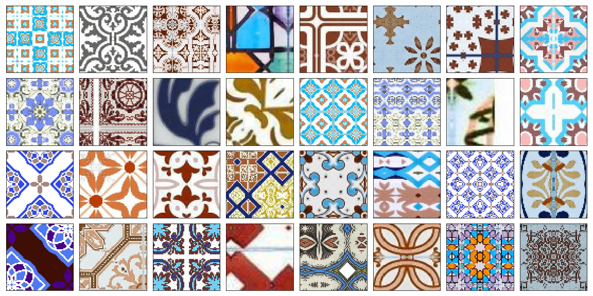
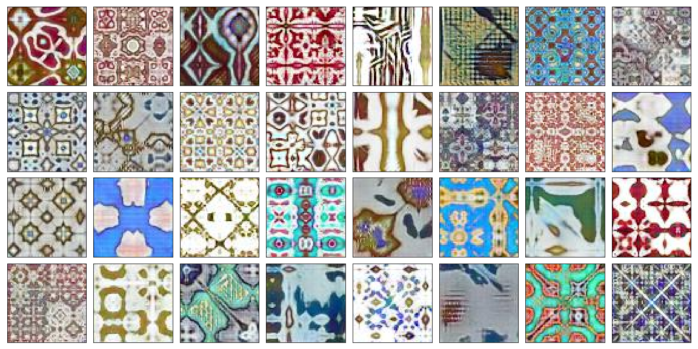

# deep-azulejo
Some of the best results

Requirements: [ai_utilities](https://github.com/prairie-guy/ai_utilities.git)

In this project I want to generate images of Portuguese ceramic tiles, also known as [azulejo](https://en.wikipedia.org/wiki/Azulejo).

Steps:

0. Get data by scrapping google and bing

Using notebook [0.1](0.1%20Getting%20data%20using%20ai-utilities.ipynb) I scrapped images, plus I dowloaded a small sample of images by hand.

In the end there were 1907 images ready for the next steps. 

1. Select usable images from scrapped data: square, symmetric, etc.

I wanted specific qualities from the images, such as:

- Image consisting fully of the tile or a grid of tiles
- Tile should be symmetric
- Detailed
- If image is a grid, it should be cut into separate tiles
    
Many of the scrapped images were undesirable for me.
See [1.1](1.1%20Image%20filtering%20-%20by%20aspect%20ratio.ipynb), [1.2](1.2%20Image%20filtering%20-%20by%20contrast.ipynb), [1.3](1.3%20Image%20filtering%20-%20by%20symmetry.ipynb), [1.4](1.4%20Image%20filtering%20-%20by%20multitile%20search.ipynb), and [1.5](1.5%20Saving%20pre-processed%20images.ipynb) for selection process.

In the end I obtained 1808 training worthy images.

2. Enrich sample by manipulating images (cutting, rotating, gluing together).

See [2.1](2.1%20Testing%20enriching%20data.ipynb) and [2.2](2.2%20Creating%20synthetic%20data.ipynb) for the process.

After all the enriching I had 347635 images in the dataset.

3. Using GAN to generate unseen images of tiles

I resized images to 64x64 for training

Using WGAN-GP (see [3.2.1](3.2.1%20Using%20pytorch%20-%20wgan%20implementation.ipynb) for training code):

Some more!

Some of them are cool, others are of acquired taste.

