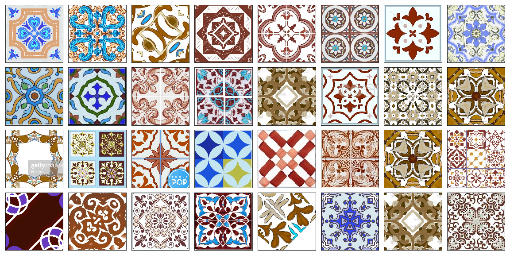

# deep-azulejo
Requirements: [ai_utilities](https://github.com/prairie-guy/ai_utilities.git)

In this project I want to generate images of Portuguese ceramic tiles, also known as [azulejo](https://en.wikipedia.org/wiki/Azulejo).

Steps:

0. Get data by scrapping google and bing

Using notebook [0.2](0.2 Getting data using ai-utilities.ipynb) (mostly 0.2) I scrapped 1907 images. 

1. Select usable images from scrapped data: square, symmetric, etc.

I wanted specific qualities from the images, such as:

    - Image consisting fully of the tile or a grid of tiles
    - Tile should be symmetric
    - Detailed
    - If image is a grid, it should be cut into separate tiles
    
Many of the scrapped images were undesirable for me.
See [1.1](1.1 Image filtering - by aspect ratio.ipynb), [1.2](1.2 Image filtering - by contrast.ipynb), [1.3](1.3 Image filtering - by symmetry.ipynb), [1.4](1.4 Image filtering - by multitile search.ipynb), and [1.5](1.5 Saving pre-processed images.ipynb) for selection process.

In the end I obtained 1808 training worthy images.

2. Enrich sample by manipulating images (cutting, rotating, gluing together).

See [2.1](2.1 Testing enriching data.ipynb) and [2.2](2.2 Creating synthetic data.ipynb) for the process.

After all the enriching I had 347635 images in the dataset.

3. Using GAN to generate unseen images of tiles

Using WGAP-GP:

Some of then are cool, others are of acquired taste.

